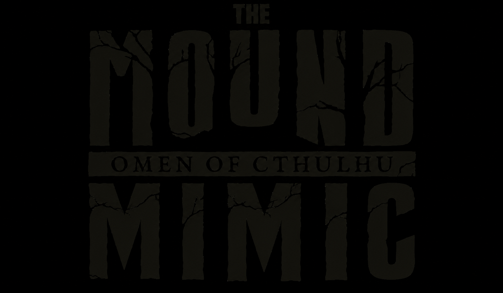
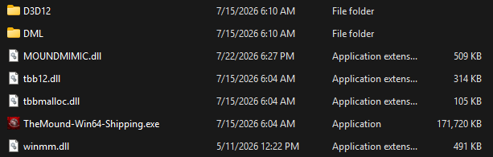
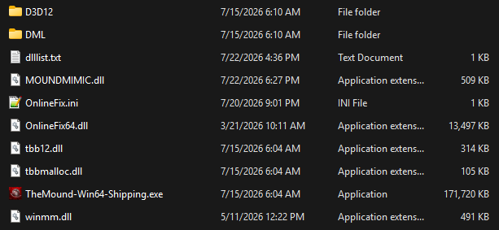
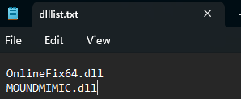
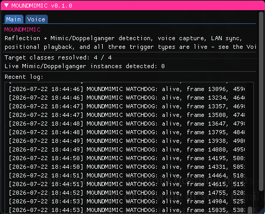
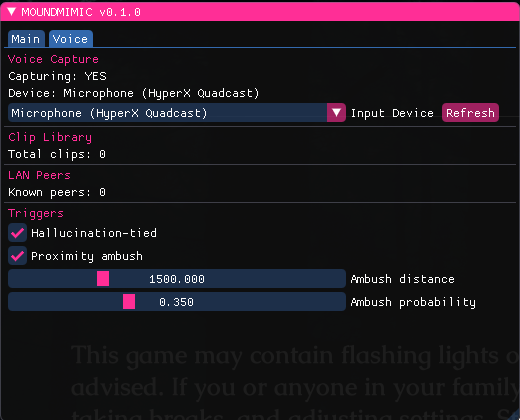

<div align="center">



**Your voice becomes the bait.**

A mod for *The Mound: Omen of Cthulhu* that makes corrupted characters sound like the real teammate they're impersonating - not a random voice, not your own.

</div>

<br>

> **For private, consenting lobbies with friends only.** This is a prank/content tool, not something to use on strangers or in public matchmaking. Everyone in the lobby should know it's active.

<br>

## What it does

- Records short clips of your voice while you play - locally, nothing leaves your machine except to teammates in your own session.
- Shares those clips with other players running the mod.
- When a player fully dies and their corrupted double spawns, MOUNDMIMIC identifies *which real player* that double represents and plays a clip of **that specific person's own voice** through it.
- You will never hear your own voice played back to yourself - only your teammates hear it, if it's your corrupted double talking.
- If the impersonated player hasn't spoken into their mic yet that session, the double just stays silent instead of guessing.
- Includes an optional proximity trigger: if you're alone near a real hostile, a decoy teammate voice can play nearby to unsettle you.
- Every recorded voice clip is wiped at the start of each new game session - nothing persists between launches.

<br>

## Requirements

| | |
|---|---|
| OS | Windows 10/11, 64-bit |
| Game | The Mound: Omen of Cthulhu |
| Hardware | A working microphone |
| Extra tools | None - no installer, no admin rights, no dependencies |

<br>

## Installation

### 1. Find your game folder

The mod goes inside the game's `Binaries\Win64` folder. The easiest way to find it on any setup:

- In Steam, right-click **The Mound: Omen of Cthulhu** → **Manage** → **Browse Local Files**.
- Inside the folder that opens, navigate to `TheMound\Binaries\Win64\`.

If you'd rather find it manually, the default Steam path is usually:

```
C:\Program Files (x86)\Steam\steamapps\common\The Mound Omen of Cthulhu\TheMound\Binaries\Win64\
```

(If your Steam library is on a different drive, e.g. `D:\SteamLibrary\...`, just swap the drive/path - the `TheMound\Binaries\Win64` part at the end stays the same.)

### 2. Copy the mod in

From this repo's [`mod/`](mod/) folder, copy **`MOUNDMIMIC.dll`** into that `Binaries\Win64` folder. That's the whole install - no other files are required.

Your folder should now look something like this:

<div align="center">

</div>

<br>

## Running it

MOUNDMIMIC is a DLL, not a standalone program - it needs to be loaded into the game process. There are two ways to do that.

### Option A: Manual loader

*Simplest option - works on any installation, no prerequisites.*

1. Launch **The Mound: Omen of Cthulhu** normally through Steam and get into a level (or even just sit at the main menu).
2. Run **`MOUNDMIMIC_Loader.exe`** (also in [`mod/`](mod/)) - copy it anywhere convenient, like your Desktop.
3. It finds the running game automatically and injects the mod within a few seconds.
4. Run the loader again each time you relaunch the game.

### Option B: Fully automatic loading (OnlineFix installs)

*No manual step, ever - the mod loads itself every time the game starts.*

If your copy already has an OnlineFix DLL loader present, you'll see a `dlllist.txt` file sitting in the same `Binaries\Win64` folder, alongside `OnlineFix64.dll`:

<div align="center">

</div>

Open `dlllist.txt` in a text editor and add `MOUNDMIMIC.dll` as its own new line:

```
OnlineFix64.dll
MOUNDMIMIC.dll
```

<div align="center">

</div>

Save it, and the game will load MOUNDMIMIC automatically from then on - no more running a loader manually.

<br>

## Using the mod

Once loaded, press **INSERT** in-game to open the MOUNDMIMIC menu.

### Main tab

Status log, reflection/detection health, and a live view of what the mod is doing under the hood.

<div align="center">

</div>

### Voice tab

Mic capture status and device picker, clip library size, connected teammates, and the trigger controls (hallucination-tied, proximity ambush with distance/probability sliders).

<div align="center">

</div>

Nothing needs to be configured to work - the defaults are sane. The device picker is only there if your system default mic isn't the one you actually want to use.

<br>

## How the voice-matching works

Each player running the mod records their own voice locally and shares clips with teammates over the session. When the game spawns a corrupted double of a player who just died, MOUNDMIMIC identifies exactly which real player that double represents and plays a clip of *their* actual recorded voice through it - not a random pick, and never your own voice back at you.

<br>

## Troubleshooting

**Nothing happens after running the loader.**
Make sure the game is already running first - the loader waits for the game process to exist but won't launch the game itself. Double-check `MOUNDMIMIC.dll` is actually present in `Binaries\Win64`.

**The menu doesn't open when I press INSERT.**
The mod may still be initializing, especially right after a fresh injection. Wait a few seconds and try again.

**My mic isn't being picked up.**
Open the Voice tab and use the Input Device dropdown to pick your mic explicitly instead of relying on the system default - hit Refresh if you plugged it in after opening the menu.

**I don't hear anything when a corrupted character should be talking.**
Often correct, not a bug - MOUNDMIMIC won't play a guessed or wrong voice. If the specific player being impersonated hasn't spoken into their mic yet this session, it intentionally stays silent for that instance.

**Voice sounds flat, or not like it's coming from the right direction.**
Make sure your Windows audio output device is actually set to a real stereo (2-channel) device in Windows Sound settings - a virtual surround/7.1 output configuration can interfere with directional audio even on headphones.

<br>

## Uninstalling

Delete `MOUNDMIMIC.dll` from the game's `Binaries\Win64` folder (and remove its line from `dlllist.txt` if you added one). No registry entries, no other files, nothing else to clean up.
